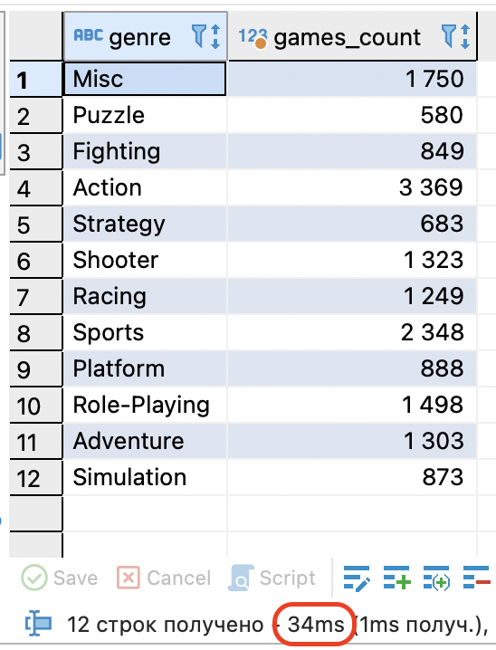
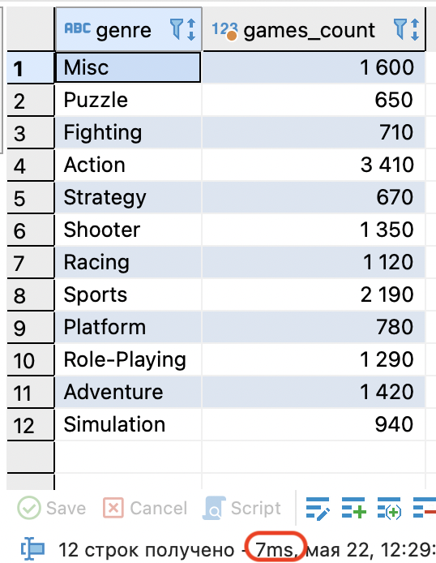

# Источники

1. [ClickHouse — Расширенный учебник](https://clickhouse.com/docs/ru/tutorial?ysclid=mamnuisrw166081382 )
2. [Яндекс.Практикум](https://practicum.yandex.ru/profile/ycloud-datamart/ )

# Введение
ClickHouse - это высокопроизводительная аналитическая СУБД с открытым исходным кодом, разработанная компанией Яндекс. Она широко используется в различных сферах благодаря своей эффективности и функциональности.  

ClickHouse ценится по нескольким причинам:  
* `Производительность` Эта СУБД способна значительно сжимать данные и обрабатывать типичные запросы быстрее, чем многие другие системы. Её архитектура оптимизирована для работы с большими объемами данных.  
* `Масштабируемость` ClickHouse поддерживает распределённую работу на нескольких серверах, что позволяет легко масштабировать систему по мере роста нагрузки.  
* `Надёжность` В ClickHouse реализованы мощные инструменты для резервного копирования и восстановления данных, что обеспечивает высокую степень надёжности и устойчивости к сбоям.  

Пример работы со столбцовыми СУБД
Рассмотрим, как устроены столбцовые СУБД на примере анализа данных в крупном банке. Представьте, что вы работаете с таблицей клиентов, которая содержит личные данные, номера счетов и договоров.  

`Классическая строковая СУБД ` 
| last_name | first_name | middle_name   | age | card_nmb         |
|-----------|------------|----------------|-----|------------------|
| Иванов    | Сидор      | Петрович       | 25  | 1234234400007777 |
| Петров    | Иван       | Сидорович      | 35  | 5555667300004835 |
| Сидоров   | Пётр       | Иванович       | 45  | 2543165800002354 |

Это стандартное представление: одна строка — один клиент.  

`Столбцовая СУБД`  
| last_name | Иванов | Петров | Сидоров |
|-----------|--------|--------|---------|
| first_name | Сидор  | Иван   | Пётр    |
| middle_name | Петрович | Сидорович | Иванович |
| age       | 25     | 35     | 45      |
| card_nmb  | 1234 2344 0000 7777 | 5555 6673 0000 4835 | 2543 1658 0000 2354 |

На первый взгляд разница кажется незначительной — таблица просто «повернута» на 90 градусов. Однако у такого способа хранения данных есть существенные преимущества.  

`Преимущества столбцовых СУБД`
* Эффективная обработка агрегатных запросов (суммы, средние значения, подсчёты).  
* Лучшая компрессия данных , так как одинаковые типы данных хранятся вместе.  
* Более высокая производительность при анализе больших объёмов данных .  
* Упрощённая работа с отдельными столбцами без необходимости загружать всю строку.  

## Недостатки столбцовых СУБД

Каждый инструмент имеет свои сильные и слабые стороны, и столбцовые СУБД не являются исключением. Их архитектура особенно эффективна для задач, где требуется:  
* Обработка всей таблицы или её значимой части;  
* Получение обобщённой информации вместо конкретных записей;  
* Анализ небольшого количества столбцов из множества доступных.  

Однако у такой структуры есть и ограничения. Основной недостаток столбцовой СУБД — низкая производительность при записи новых данных . Поскольку данные хранятся по столбцам, добавление новой строки требует записи значений в каждый из столбцов, что может быть медленнее, чем в строковых системах.  

Кроме того, редактирование уже существующих данных в столбцовой СУБД становится значительно сложнее. В отличие от строковых СУБД, где изменение одной строки не влияет на другие, в столбцовой модели изменения затрагивают весь столбец, что увеличивает нагрузку на систему и может привести к снижению производительности.  

Таким образом, столбцовые СУБД лучше подходят для аналитических задач, но менее эффективны для операций, связанных с частыми вставками и обновлениями данных.  

## Особенности ClickHouse
ClickHouse — это СУБД, которая относится к столбцовому типу. В этой системе архитектура столбцов дополнительно оптимизирована для работы с аналитическими запросами, что делает её особенно эффективной при обработке больших объёмов данных.  

Одной из важных особенностей ClickHouse является жёсткая типизация всех колонок. Это означает, что в каждом поле хранятся значения одного типа и одинаковой длины. Такой подход позволяет минимизировать использование памяти, так как не требуется выделять дополнительные байты на описание формата данных.  

Кроме того, ClickHouse поддерживает распределённую обработку данных . Для повышения надёжности используется репликация — данные копируются на несколько серверов, что обеспечивает отказоустойчивость. Также реализовано шардирование , при котором части таблицы распределяются между разными узлами, что ускоряет доступ к данным и улучшает производительность.  

Однако из-за этих дополнительных возможностей синтаксис SQL в ClickHouse отличается от стандартного . Например, в нём появляются новые правила определения структуры таблиц, а также специфические функции, которых нет в традиционных СУБД. Это может потребовать от пользователя дополнительного обучения, но в то же время делает ClickHouse мощным инструментом для аналитических задач.  

## Аналитические (OLAP) VS транзакционные (OLTP)

`OLAP` - От англ. **Online Analytical Processing** — «аналитическая обработка в реальном времени». Используется в системах, спроектированных для анализа данных.   

`OLTP` - От англ. **Online Transaction Processing** — «транзакционная обработка в реальном времени». Используется в системах, в которых часто вставляют, удаляют или изменяют отдельные записи.  

`Транзакционные СУБД` хорошо обрабатывают большой поток маленьких транзакций. Эти системы умеют быстро вставлять, изменять, удалять и отбирать отдельные записи по ключам. При этом транзакционные решения плохо справляются с выборочным сканированием атрибутов в больших таблицах. Особенно когда речь идёт о конкурентной нагрузке — то есть при одновременном чтении данных для нескольких пользователей. Примеры транзакционных СУБД: **PostgreSQL, Oracle, MS SQL Server, MySQL**.  

`Аналитические системы` позволяют быстро записывать большие объёмы данных разом, а ещё с хорошей скоростью их обрабатывать. При этом такие СУБД медленнее транзакционных вносят в базу точечные изменения вроде удаления, обновления и вставки записей. Примеры аналитических систем: **ClickHouse, Vertica, Greenplum, Exasol, Teradata, Exadata, SAP HANA**.

## Колоночные VS строковые
Помимо способа обработки данных, ключевым фактором, влияющим на эффективность СУБД, является метод хранения информации — строковый или столбцовый. В строковой системе все данные записываются построчно в один файл, тогда как в столбцовой каждая колонка сохраняется отдельно. Это позволяет при запросах считывать только нужные атрибуты, минуя остальные.

`Транзакционные базы данных обычно используют строковое хранение`, так как им требуется высокая скорость работы с небольшими объёмами данных. В то же время `аналитические системы чаще применяют столбцовый подход`, поскольку они работают с большими наборами записей и часто обращаются к отдельным полям. Например, если в таблице 150 полей, но нужно получить информацию только по пяти из них, транзакционная СУБД будет сканировать все 150 столбцов, тогда как аналитическая — только те, что нужны. Однако малые изменения в столбцовых СУБД требуют больше ресурсов, чем в строковых.   

| **Свойство**               | **Строковое хранение**                          | **Колоночное хранение**                         |
|---------------------------|--------------------------------------------------|--------------------------------------------------|
| **Способ хранения**       | Все данные записываются построчно в один файл   | Каждый атрибут хранится в отдельном файле        |
| **Пример использования**  | Транзакционные СУБД (например, банковские системы) | Аналитические СУБД (например, BI-системы)        |
| **Чтение данных**         | Читается вся строка (все столбцы)               | Читаются только нужные столбцы                   |
| **Пример**:               | Если нужно прочитать 5 полей из 150, будут сканированы все 150 | Только 5 нужных полей, остальные игнорируются     |
| **Обновления**            | Быстрые и экономичные                           | Медленные и затратные                            |

| **Тип хранения**         | **Примеры СУБД**                                                                 |
|--------------------------|----------------------------------------------------------------------------------|
| **Колоночное хранение**  | ClickHouse, Vertica, SAP HANA, Teradata, Exadata, Greenplum                      |
| **Строковое хранение**   | PostgreSQL, MS SQL Server, Oracle, MySQL, YDB                                    |
| **Аналитические СУБД с строковым хранением** | Teradata, Exadata, Greenplum (могут поддерживать оба типа в зависимости от настроек) |  

## Сэмплирование данных  
`Сэмплирование` — это метод, позволяющий выбрать подмножество данных из таблицы без полного сканирования всей таблицы. Это особенно полезно при работе с большими объемами данных, так как позволяет ускорить выполнение запросов и снизить нагрузку на систему.  

В ClickHouse сэмплирование реализуется через ключевое слово `SAMPLE`, которое указывает, какую долю данных нужно выбрать. 

`Исходный запрос:`
```sql
SELECT Genre AS genre,
       COUNT(*) AS games_count
  FROM games_data.games
 GROUP BY genre
HAVING genre <> '';
```
  

`Сэмплированный запрос:` возьмем десятую часть всех данных и умножим на 10, по идее мы должны получить такой же результат:
```sql
SELECT Genre AS genre,
       COUNT(*) * 10 AS games_count
  FROM games_data.games
SAMPLE 0.1
 GROUP BY genre
HAVING genre <> ''; 
```
  
Да, точность сильно пострадала, однако скорость выолнения запроса выросла в разы.  Сэмплирование не подходит для точных расчетов, однако так можно быстро "прикинуть" какие-то показатели на быстрой выборке.  

`Объяснение SQL-запроса и синтаксис сэмплирования`
---
`Объяснение запроса:`  
| Часть запроса | Описание |
|--------------|----------|
| `SELECT Genre AS genre` | Выбираем колонку `Genre` и называем её `genre`. |
| `COUNT(*) * 10 AS games_count` | Считаем количество записей в каждой группе (`COUNT(*)`) и умножаем на 10 для масштабирования. |
| `FROM games_data.games` | Источник данных — таблица `games` в базе `games_data`. |
| `SAMPLE 0.1` | Берём 10% случайных строк из таблицы. |
| `GROUP BY genre` | Группируем результат по жанру игры. |
| `HAVING genre <> ''` | Фильтруем результат, исключая пустые строки в поле `genre`. |

`Синтаксис сэмплирования в ClickHouse`

Чтобы использовать сэмплирование в запросе, понадобится ключевое слово `SAMPLE`, которое следует сразу за `FROM`. После `SAMPLE` прописывают параметр сэмплирования — он управляет размером выборки.  

`Варианты параметра:`
| Параметр           | Описание                                                                 |
|--------------------|--------------------------------------------------------------------------|
| `SAMPLE 0.1`       | Выбирается 10% случайных строк из таблицы (дробь от 0 до 1).             |
| `SAMPLE 1000`      | Выбирается минимум 1000 случайных строк (целое число).                   |

> ⚠️ Примечание: `SAMPLE` в ClickHouse использует **равномерное случайное сэмплирование**, то есть каждая строка имеет одинаковый шанс попасть в выборку.
