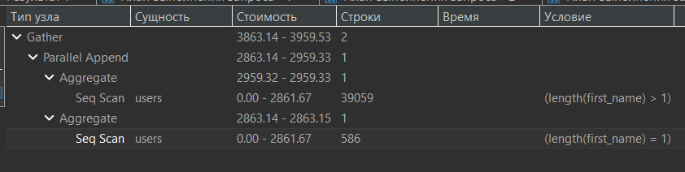

# Планировщик запросов

**Планировщик запросов** (оптимизатор) в PostgreSQL — это компонент, который анализирует SQL-запросы и генерирует наиболее эффективный план выполнения. Задача планировщика — выбрать план, который, как ожидается, будет выполняться быстрее всего.  

Чтобы получить результаты запроса, PostgreSQL выполняет следующие
шаги:  
-  компилирует и преобразует инструкцию SQL в выражение, состоящее
из логических операций высокого уровня, называемое логический план;  
- оптимизирует логический план и превращает его в план выполнения;  
- выполняет (интерпретирует) план и возвращает результаты.  

## Поэтапный алгоритм работы планировщика

1) Анализ запроса  
Планировщик проверяет синтаксис и ссылки на объекты в базе

2) Планирование запроса: 
    - поиск подходящего плана в кэше - первым делом планировщик проверяет нет ли уже скомпелированного плана в кэше   
    - поиск оптимального запроса - если плана нет к кэше нет или структура базы была изменена, планировщик искать потимальный план запроса. Составит разные и выберет оптимальный  

## EXPLAIN  

Увидеть план запроса не выплняя его можно с помощью команды  `EXPLAIN`  
```sql
EXPLAIN 
 SELECT * 
   FROM online_store.orders;
```
Результат выполнения:
```
QUERY PLAN
Seq Scan on orders  (cost=0.00..346.67 rows=21167 width=18)
(1 row)
```

# Сборщик статистики в PostgreSQL

Подсистема для сбора и отбражения информации о работе БД. Планировщик использует ее для того, чтобы оценить скорость выполнения запроса, объем данных, количество строк возвращаемых запросом.  
Например, в таблице было 1_000 записей, статистика давно не собиралась, таблица увеличилась до 1_000_000 записей. Без обновленной статистики Планировщик не зная об изменениях может подобрать неоптимальынй план выполнения запроса.  
Сборщик статистики отслеживает, например, общее число строк в каждой таблице или индексе, размеры таблиц или индексов, наиболее часто встречающиеся значения в каждом столбце и ещё множество параметров.  

## Запуск сбора статистики

Анализировать всю БД:
```sql
ANALYZE;
```

Анализ конкретных таблиц:
```sql
ANALYZE orders, clients, items;
```

Анализ конкретных полей таблицы:
```
ANALYZE orders (order_id, created_at);
```

# Оценка стоимости запроса

**Стоимость запроса** - это абстрактная величина, служащая для сравнения сравнения запросов планировщиком между собой.  

Рассмотрим пример:  
```sql
EXPLAIN 
 SELECT * 
   FROM online_store.orders;
```
Результат выполнения:
```
QUERY PLAN
Seq Scan on orders  (cost=0.00..346.67 rows=21167 width=18)
(1 row)
```
## cost
У стоимости `cost` в результате выполнения команды `EXPLAIN` указано два значения: `cost=0.00..346.67`.
- первое значение - "Стартовая стоимость", т.е. сколько потребуется времени для получения первой строки. У нас это `0.00` секунд.  
- второе значение - "Полная стоимость", зависит от количества возвращаемых данных. В нашем примере - `346.67`.  

Рассмотрим другой пример:
```sql
EXPLAIN 
 SELECT p.user_id, o.*
   FROM online_store.profiles p
   LEFT JOIN online_store.orders o ON o.user_id = p.user_id
  WHERE region = 'Russian Federation';
```
Результат выполнения:
```
QUERY PLAN
Hash Right Join  (cost=3584.61..4043.46 rows=21904 width=26)
Hash Cond: (o.user_id = p.user_id)
->  Seq Scan on orders o  (cost=0.00..346.67 rows=21167 width=18)
->  Hash  (cost=3310.81..3310.81 rows=21904 width=8)
        ->  Seq Scan on profiles p  (cost=0.00..3310.81 rows=21904 width=8) 
                Filter: (region = 'Russian Federation'::text)
(6 rows)
```

Здесь стоит обратить внимание, что мы получаем разную стоимость `cost` на разных строках, которые влияют на общую.  
- стартовая стоимость - `3584.61`  
- полная стоимость - `4043.46`  

# Чтение плана выполнения запроса

Выполним запрос:
```sql
SELECT 'Москва', 
        count(*) 
  FROM clients c 
 WHERE c.city = 'Москва'

UNION ALL

SELECT 'Не Москва', 
       count(*) 
  FROM clients c 
 WHERE c.city != 'Москва';
```

План выполнения:
```
Append **** (cost=15.94..33.30 rows=2 width=40) 
        (actual time=0.130..0.292 rows=2 loops=1)
  ->  Aggregate  (cost=15.94..15.95 rows=1 width=40) 
                 (actual time=0.129..0.130 rows=1 loops=1)
        ->  Seq Scan on clients c  (cost=0.00..15.75 rows=76 width=0) 
                                   (actual time=0.017..0.122 rows=76 loops=1)
                Filter: ((city)::text = 'Москва'::text)
                Rows Removed by Filter: 624
  ->  Aggregate  (cost=17.31..17.32 rows=1 width=40) 
                 (actual time=0.160..0.160 rows=1 loops=1)
        ->  Seq Scan on clients c_1  (cost=0.00..15.75 rows=624 width=0) 
                                     (actual time=0.010..0.129 rows=624 loops=1)
                Filter: ((city)::text <> 'Москва'::text)
                Rows Removed by Filter: 76
Planning Time: 0.188 ms
Execution Time: 0.325 ms
```

План представлен в виде дерева, каждый шаг в нем - узед `->`.  Все узлы, кроме корневого отмечают стрелкой `->`, здесь корневой узел это `Append`. План читается снизу вверх. Каждый узел передает вышестоящему свои результаты. В нашем примере можно выделить:  
- `Seq Scan` - последовательное сканирование    
- `Agregate` - агрегирование данных    
- `Append` - объединение двух результирующих наборов через `UNION ALL`  

Дополнительно может быть указана разная информация, например: 
- У операции сканирования `Seq Scan` мы видим `Filter`. Видно условия фильтрация и количество отсеянных строк `Rows Removed by Filter`  

Стоит также обратить внимание на то, что операции выполняются снизу вверх от дочерних узлов к вышестоящим, так, в нашем примере сначала независимо друг от друга выполяется сканирование `Seq Scan`, затем агрегирование `Agregate` и в самом конце объединение `Append`.  

## Ожидаемый и фактический план выполнения запроса

### Ожидаемый

`EXPLAIN` - запрос не выполняется, затраты ожидаемые.  
```sql
EXPLAIN 
 SELECT COUNT(*) 
   FROM tools_shop.users;
```

### Фактический

`EXPLAIN ANALYZE` - запрос выполняется, возвращает план выполнения. Реальные затраты.  
```sql
EXPLAIN ANALYZE
 SELECT COUNT(*) 
   FROM tools_shop.users;
```

**Важно!** Поскольку `EXPLAIN ANALYZE` сначала выполняет запрос а затем возвращает план его выполнения нужно быть очень аккуратным и не использовать его вместе с `DELETE`, `UPDATE`, `INSERT`.  

Либо используйте транзакции:  
```sql
BEGIN;
EXPLAIN ANALYZE … ;
ROLLBACK; 
```

## Формат плана запроса

### xml, json, yaml

По умолчанию план выполнения запроса возвращается в текстовом варианте, однако можно получить его в формате `xml`, `json`, `yaml`.  

```sql
EXPLAIN (FORMAT json)
 SELECT COUNT(*) 
   FROM tools_shop.users;

EXPLAIN (ANALYZE, FORMAT xml)
 SELECT COUNT(*) 
   FROM tools_shop.users;
```

вывод:
```json
[
  {
    "Plan": {
      "Node Type": "Aggregate",
      "Strategy": "Plain",
      "Partial Mode": "Simple",
      "Parallel Aware": false,
      "Async Capable": false,
      "Startup Cost": 2568.72,
      "Total Cost": 2568.74,
      "Plan Rows": 1,
      "Plan Width": 8,
      "Disabled": false,
      "Plans": [
        {
          "Node Type": "Seq Scan",
          "Parent Relationship": "Outer",
          "Parallel Aware": false,
          "Async Capable": false,
          "Relation Name": "users",
          "Alias": "users",
          "Startup Cost": 0.00,
          "Total Cost": 2275.78,
          "Plan Rows": 117178,
          "Plan Width": 0,
          "Disabled": false
        }
      ]
    }
  }
]
```

### Графическое отображение

Выполнив запрос
```sql
SELECT 'Имя не заполнено' as descr, 
       COUNT(*) AS qty
  FROM tools_shop.users
 WHERE LENGTH(first_name) = 1
 UNION ALL
SELECT 'Имя заполнено', 
       COUNT(*) AS qty 
  FROM tools_shop.users
 WHERE LENGTH(first_name) > 1;
 ```

 Мы  увидим весьма запутанную структуру  
```bash
Gather  (cost=3863.14..3959.53 rows=2 width=40) (actual time=10.088..40.231 rows=2.00 loops=1)
  Workers Planned: 2
  Workers Launched: 2
  Buffers: shared hit=2208
  ->  Parallel Append  (cost=2863.14..2959.33 rows=1 width=40) (actual time=3.186..7.381 rows=0.67 loops=3)
        Buffers: shared hit=2208
        ->  Aggregate  (cost=2959.32..2959.33 rows=1 width=40) (actual time=12.580..12.580 rows=1.00 loops=1)
              Buffers: shared hit=1104
              ->  Seq Scan on users  (cost=0.00..2861.67 rows=39059 width=0) (actual time=0.024..9.351 rows=85249.00 loops=1)
                    Filter: (length(first_name) > 1)
                    Rows Removed by Filter: 31929
                    Buffers: shared hit=1104
        ->  Aggregate  (cost=2863.14..2863.15 rows=1 width=40) (actual time=9.554..9.554 rows=1.00 loops=1)
              Buffers: shared hit=1104
              ->  Seq Scan on users users_1  (cost=0.00..2861.67 rows=586 width=0) (actual time=0.021..8.125 rows=31929.00 loops=1)
                    Filter: (length(first_name) = 1)
                    Rows Removed by Filter: 85249
                    Buffers: shared hit=1104
Planning Time: 0.107 ms
Execution Time: 40.274 ms
```

Однако можно использовать графическое отображение, запустив запрос комбинацией клавиш `Ctrl` + `Shift` + `E` в DBeaver и поулчить план в очень удобном графическом виде.



Запрос выполняется с использованием параллельного плана:

- На первом уровне два процесса производят последовательное сканирование таблицы `users` с последующей агрегацией

- На втором уровне узел `Append` объединяет результаты от процессов

- На третьем уровне узел `Gather` координирует параллельное выполнение и возвращает финальный результат

Для анализа плана выполнения запроса можно также использовать онлайн-сервисы, например, https://explain.tensor.ru. 

## Показатели в пдане выполнения запроса

Рассмотрим запрос:
```bash
Gather  (cost=6702.27..6894.86 rows=2 width=40) 
        (actual time=97.088..211.292 rows=2 loops=1)
  Workers Planned: 2
  Workers Launched: 2
      ->  Parallel Append  (cost=5702.27..5894.66 rows=1 width=40) 
                         (actual time=32.172..70.201 rows=1 loops=3)
        ->  Aggregate  (cost=5894.64..5894.65 rows=1 width=40) 
                       (actual time=114.078..114.079 rows=1 loops=1)
              ->  Seq Scan on users  (cost=0.00..5699.34 rows=78119 width=0) 
                                     (actual time=0.029..94.106 rows=170498 loops=1)
                    Filter: (length(first_name) > 1)
                    Rows Removed by Filter: 63858
        ->  Aggregate  (cost=5702.27..5702.28 rows=1 width=40) 
                       (actual time=96.506..96.507 rows=1 loops=1)
              ->  Seq Scan on users users_1  
                           (cost=0.00..5699.34 rows=1172 width=0) 
                           (actual time=0.043..88.811 rows=63858 loops=1)
                    Filter: (length(first_name) = 1)
                    Rows Removed by Filter: 170498
Planning Time: 0.183 ms
Execution Time: 211.355 ms
```

Актуально для `EXPLAIN ANALYSE`
```bash
Planning Time: 0.183 ms    -- время планирования и выбора лучше варианта
Execution Time: 211.355 ms -- время выполнения и возврата результата
```


```bash
Gather  (cost=6702.27..6894.86 rows=2 width=40) 
        (actual time=97.088..211.292 rows=2 loops=1)
```

У корневого `Gather` и дочерних `->` в скобках перечисленые показатели: 
- `cost` - стоимость выполнения узла, а т.к. узел корневой, то и всех дочерних узлов учтена в этой стоимомости. Как и ранее, первое число - стоимость получения первой строки, второе число - стоимость получения всего набора. По этому значению можно сравнивать запросы для выбора наилучшего, с минимальнйо стоимостью.    
- `rows` - общее количество строк, ожидаемых в выводе. В нашем примере их две.   
- `width` - это количество байт в каждой строке в выводе.  

Вторые скобки актуальны для `EXPLAIN ANALYSE`:  
- `actual time` - фактическое время получения первой строки и всего набора. Может сильно зависеть от загрузки на сервере.   
- `rows` - количество строк в результирующем наборе. Если колчиество строк в факте сильно отличается от ожидаемого количества, возможно стоит обновить статистику т.к. вероятно она неактуальна.   
- `loops` - количество выполнений узла. В других случая узел может выполняться несколько раз для получения результата.  

Напрмиер:  
```bash
Parallel Append  (cost=5702.27..5894.66 rows=1 width=40) 
                 (actual time=32.172..70.201 rows=1 loops=3)
```
узел выполнялся трижды `loops=3`. Среднее время на итерацию 70, прохода 3, 3 * 70 = 210 мс. 

### Вывод доп. информации

