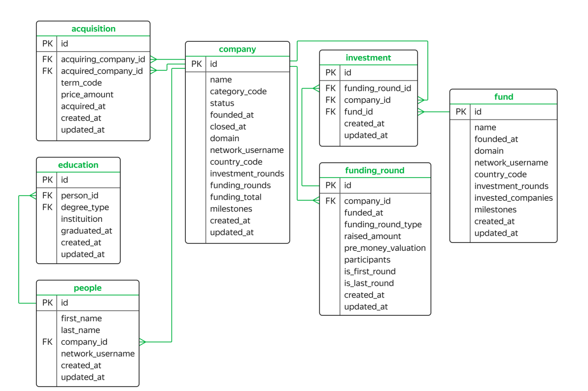

# Знакомство с базой данных

В самостоятельном проекте этого курса вы будете работать с базой данных, которая хранит информацию о венчурных фондах и инвестициях в компании-стартапы. Эта база данных основана на датасете Startup Investments, опубликованном на популярной платформе для соревнований по исследованию данных Kaggle.

Анализировать рынок инвестиций без подготовки может быть непросто. Поэтому сначала познакомьтесь с важными понятиями, которые вам встретятся в работе с базой данных.

## Ключевые понятия

### Венчурные фонды
**Венчурные фонды** — это финансовые организации, которые могут позволить себе высокий риск и инвестировать в компании с инновационной бизнес-идеей или разработанной новой технологией, то есть в стартапы. Цель венчурных фондов — в будущем получить значительную прибыль, которая в разы превысит размер их трат на инвестиции в компанию. Если стартап подорожает, венчурный фонд может получить долю в компании или фиксированный процент от её выручки.

### Раунды финансирования
Чтобы процесс финансирования стал менее рискованным, его делят на стадии — **раунды**. Тот или иной раунд зависит от того, какого уровня развития достигла компания.

*   **Предпосевной (pre-seed)** и **посевной (seed)** раунды. Предпосевной раунд предполагает, что компания как таковая ещё не создана и находится в стадии замысла. Следующий — посевной — раунд знаменует рост проекта: создатели компании разрабатывают бизнес-модель и привлекают инвесторов.
*   **Ангельский (angel)** раунд. Если компании требуется ментор или наставник — она привлекает бизнес-ангела. **Бизнес-ангелы** — инвесторы, которые помимо финансовой поддержки предлагают экспертную помощь.
*   **Ранние раунды (A, B, C, D...)**. Когда стартап становится компанией с проверенной бизнес-моделью и начинает зарабатывать самостоятельно, предложений инвесторов становится больше. Это раунд A, а за ним следуют и другие: B, C, D — на этих этапах компания активно развивается и готовится к IPO.
*   **Венчурный (venture)** раунд — финансирование, которое могло поступить от венчурного фонда на любом этапе: начальном или более позднем.

> **Важно:** В данных об инвестициях вам встретятся упоминания раундов, но самостоятельный проект не предполагает, что вы должны разбираться в их специфике лучше любого инвестора. Главное — понимать, как устроены данные.

Вы уже знаете, что такое ER-диаграмма. Работу с новой базой данных лучше начать с изучения схемы.

---

## Описание таблиц базы данных

### Таблица `acquisition`
Содержит информацию о покупках одних компаний другими.

| Поле | Тип | Описание |
| :--- | :--- | :--- |
| `id` | `PRIMARY KEY` | Уникальный номер покупки. |
| `acquiring_company_id` | `FOREIGN KEY` → `company(id)` | Идентификатор компании-покупателя. |
| `acquired_company_id` | `FOREIGN KEY` → `company(id)` | Идентификатор покупаемой компании. |
| `term_code` | `VARCHAR` | Способ оплаты сделки: `cash` (наличные), `stock` (акции), `cash_and_stock` (смешанный). |
| `price_amount` | `DECIMAL` | Сумма покупки в долларах. |
| `acquired_at` | `DATE` | Дата совершения сделки. |
| `created_at` | `TIMESTAMP` | Дата и время создания записи. |
| `updated_at` | `TIMESTAMP` | Дата и время обновления записи. |

### Таблица `company`
Содержит информацию о компаниях-стартапах.

| Поле | Тип | Описание |
| :--- | :--- | :--- |
| `id` | `PRIMARY KEY` | Уникальный номер компании. |
| `name` | `VARCHAR` | Название компании. |
| `category_code` | `VARCHAR` | Категория деятельности (напр., `news`, `social`). |
| `status` | `VARCHAR` | Статус компании: `acquired` (приобретена), `operating` (действует), `ipo` (вышла на IPO), `closed` (закрыта). |
| `founded_at` | `DATE` | Дата основания компании. |
| `closed_at` | `DATE` | Дата закрытия компании (если применимо). |
| `domain` | `VARCHAR` | Домен сайта компании. |
| `network_username` | `VARCHAR` | Профиль в корпоративной сети биржи. |
| `country_code` | `CHAR(3)` | Код страны (напр., `USA`, `GBR`). |
| `investment_rounds` | `INT` | Число раундов, в которых компания участвовала как инвестор. |
| `funding_rounds` | `INT` | Число раундов, в которых компания привлекала инвестиции. |
| `funding_total` | `DECIMAL` | Сумма привлечённых инвестиций в долларах. |
| `milestones` | `INT` | Количество важных этапов в истории компании. |
| `created_at` | `TIMESTAMP` | Дата и время создания записи. |
| `updated_at` | `TIMESTAMP` | Дата и время обновления записи. |

### Таблица `education`
Хранит информацию об уровне образования сотрудников компаний.

| Поле | Тип | Описание |
| :--- | :--- | :--- |
| `id` | `PRIMARY KEY` | Уникальный номер записи об образовании. |
| `person_id` | `FOREIGN KEY` → `people(id)` | Идентификатор человека. |
| `degree_type` | `VARCHAR` | Учебная степень (напр., `BA` — бакалавр, `MS` — магистр). |
| `instituition` | `VARCHAR` | Название учебного заведения. |
| `graduated_at` | `DATE` | Дата выпуска. |
| `created_at` | `TIMESTAMP` | Дата и время создания записи. |
| `updated_at` | `TIMESTAMP` | Дата и время обновления записи. |

### Таблица `fund`
Хранит информацию о венчурных фондах.

| Поле | Тип | Описание |
| :--- | :--- | :--- |
| `id` | `PRIMARY KEY` | Уникальный номер венчурного фонда. |
| `name` | `VARCHAR` | Название фонда. |
| `founded_at` | `DATE` | Дата основания фонда. |
| `domain` | `VARCHAR` | Домен сайта фонда. |
| `network_username` | `VARCHAR` | Профиль фонда в корпоративной сети биржи. |
| `country_code` | `CHAR(3)` | Код страны фонда. |
| `investment_rounds` | `INT` | Число инвестиционных раундов с участием фонда. |
| `invested_companies` | `INT` | Число компаний, в которые инвестировал фонд. |
| `milestones` | `INT` | Количество важных этапов в истории фонда. |
| `created_at` | `TIMESTAMP` | Дата и время создания записи. |
| `updated_at` | `TIMESTAMP` | Дата и время обновления записи. |

### Таблица `funding_round`
Содержит информацию о раундах инвестиций.

| Поле | Тип | Описание |
| :--- | :--- | :--- |
| `id` | `PRIMARY KEY` | Уникальный номер инвестиционного раунда. |
| `company_id` | `FOREIGN KEY` → `company(id)` | Идентификатор компании-участницы раунда. |
| `funded_at` | `DATE` | Дата проведения раунда. |
| `funding_round_type` | `VARCHAR` | Тип раунда (напр., `venture`, `angel`, `series_a`). |
| `raised_amount` | `DECIMAL` | Сумма привлечённых инвестиций в долларах. |
| `pre_money_valuation` | `DECIMAL` | Предварительная оценка стоимости компании до инвестиций (в долларах). |
| `participants` | `INT` | Количество участников раунда. |
| `is_first_round` | `BOOLEAN` | Является ли раунд первым для компании. |
| `is_last_round` | `BOOLEAN` | Является ли раунд последним для компании. |
| `created_at` | `TIMESTAMP` | Дата и время создания записи. |
| `updated_at` | `TIMESTAMP` | Дата и время обновления записи. |

### Таблица `investment`
Содержит информацию об инвестициях венчурных фондов в стартапы.

| Поле | Тип | Описание |
| :--- | :--- | :--- |
| `id` | `PRIMARY KEY` | Уникальный номер инвестиции. |
| `funding_round_id` | `FOREIGN KEY` → `funding_round(id)` | Идентификатор раунда инвестиции. |
| `company_id` | `FOREIGN KEY` → `company(id)` | Идентификатор компании-стартапа. |
| `fund_id` | `FOREIGN KEY` → `fund(id)` | Идентификатор фонда-инвестора. |
| `created_at` | `TIMESTAMP` | Дата и время создания записи. |
| `updated_at` | `TIMESTAMP` | Дата и время обновления записи. |

### Таблица `people`
Содержит информацию о сотрудниках компаний-стартапов.

| Поле | Тип | Описание |
| :--- | :--- | :--- |
| `id` | `PRIMARY KEY` | Уникальный номер сотрудника. |
| `first_name` | `VARCHAR` | Имя сотрудника. |
| `last_name` | `VARCHAR` | Фамилия сотрудника. |
| `company_id` | `FOREIGN KEY` → `company(id)` | Идентификатор компании-работодателя. |
| `network_username` | `VARCHAR` | Профиль в корпоративной сети биржи. |
| `created_at` | `TIMESTAMP` | Дата и время создания записи. |
| `updated_at` | `TIMESTAMP` | Дата и время обновления записи. |