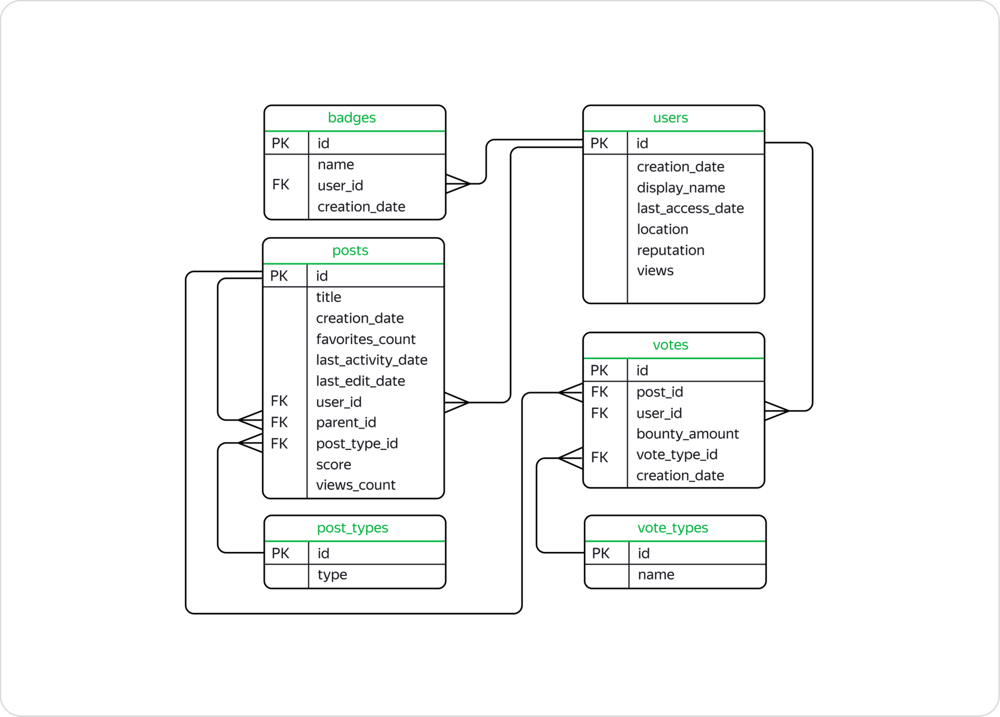

# Описание проекта: Анализ данных StackOverflow

Проект состоит из двух частей:

1.  **Практическая часть** — решение задач в SQL-тренажёре для закрепления материала.
2.  **Аналитическая часть** — исследовательские задачи, проверяемые тренажёром, но требующие самостоятельного анализа и формулировки выводов.

> **Важно:** Внимательно читайте условия. Формулировки задач приближены к реальным бизнес-задачам, таким как «рассчитать метрику за период», «отобрать самых активных пользователей» или «выявить причину изменений».

## Контекст проекта
Вы будете работать с базой данных **StackOverflow** — сервиса вопросов и ответов о программировании. Платформа функционирует по принципу социальной сети: пользователи задают вопросы, отвечают на посты, оставляют комментарии и оценивают публикации друг друга.

**О данных:** Используется срез данных за 2008 год, однако в таблицах присутствует информация о более поздних действиях (например, оценках), полученных этими постами.

Рекомендуется начать работу с изучения **ER-диаграммы** базы данных.

---

## Описание таблиц базы данных `stackoverflow`

### Таблица `badges`
Хранит информацию о значках, которые присуждаются пользователям за различные достижения (например, значок `postgresql` за множество правильных ответов по соответствующей теме).

| Поле | Тип | Описание |
| :--- | :--- | :--- |
| `id` | `PRIMARY KEY` | Уникальный идентификатор значка. |
| `name` | `VARCHAR` | Название значка. |
| `user_id` | `FOREIGN KEY` → `users(id)` | Идентификатор пользователя, получившего значок. |
| `creation_date` | `TIMESTAMP/DATE` | Дата присвоения значка. |

### Таблица `post_types`
Справочник типов публикаций (постов).

| Поле | Тип | Описание |
| :--- | :--- | :--- |
| `id` | `PRIMARY KEY` | Уникальный идентификатор типа поста. |
| `type` | `VARCHAR` | Тип поста: `Question` (вопрос) или `Answer` (ответ). |

### Таблица `posts`
Основная таблица, содержащая информацию о публикациях (вопросах и ответах).

| Поле | Тип | Описание |
| :--- | :--- | :--- |
| `id` | `PRIMARY KEY` | Уникальный идентификатор поста. |
| `title` | `VARCHAR` | Заголовок поста (в основном для вопросов). |
| `creation_date` | `TIMESTAMP/DATE` | Дата создания поста. |
| `favorites_count` | `INT` | Количество добавлений поста в «Закладки». |
| `last_activity_date` | `TIMESTAMP/DATE` | Дата последнего действия в посте (например, комментария). |
| `last_edit_date` | `TIMESTAMP/DATE` | Дата последнего редактирования поста. |
| `user_id` | `FOREIGN KEY` → `users(id)` | Идентификатор автора поста. |
| `parent_id` | `FOREIGN KEY` → `posts(id)` | Для ответов (`Answer`) — идентификатор родительского поста с вопросом (`Question`). |
| `post_type_id` | `FOREIGN KEY` → `post_types(id)` | Идентификатор типа поста (вопрос/ответ). |
| `score` | `INT` | Рейтинг (количество очков), набранный постом. |
| `views_count` | `INT` | Количество просмотров поста. |

### Таблица `users`
Содержит информацию о зарегистрированных пользователях.

| Поле | Тип | Описание |
| :--- | :--- | :--- |
| `id` | `PRIMARY KEY` | Уникальный идентификатор пользователя. |
| `creation_date` | `TIMESTAMP/DATE` | Дата регистрации. |
| `display_name` | `VARCHAR` | Отображаемое имя пользователя. |
| `last_access_date` | `TIMESTAMP/DATE` | Дата последнего входа на платформу. |
| `location` | `VARCHAR` | Указанное местоположение. |
| `reputation` | `INT` | Репутация — очки, начисляемые за полезный контент. |
| `views` | `INT` | Количество просмотров профиля пользователя. |

### Таблица `vote_types`
Справочник типов голосов (оценок), которые пользователи могут ставить постам.

| Поле | Тип | Описание |
| :--- | :--- | :--- |
| `id` | `PRIMARY KEY` | Уникальный идентификатор типа голоса. |
| `name` | `VARCHAR` | Название типа (метки). Основные: `UpMod` (полезный пост), `DownMod` (неполезный пост), `Close` (требует закрытия), `Offensive` (оскорбительный), `Spam` (реклама). |

### Таблица `votes`
Хранит историю всех голосов (оценок), поставленных постам.

| Поле | Тип | Описание |
| :--- | :--- | :--- |
| `id` | `PRIMARY KEY` | Уникальный идентификатор голоса. |
| `post_id` | `FOREIGN KEY` → `posts(id)` | Идентификатор поста, который оценили. |
| `user_id` | `FOREIGN KEY` → `users(id)` | Идентификатор пользователя, поставившего оценку. |
| `bounty_amount` | `INT` | Размер вознаграждения, назначенного для привлечения внимания к посту. |
| `vote_type_id` | `FOREIGN KEY` → `vote_types(id)` | Идентификатор типа поставленной оценки. |
| `creation_date` | `TIMESTAMP/DATE` | Дата проставления голоса. |